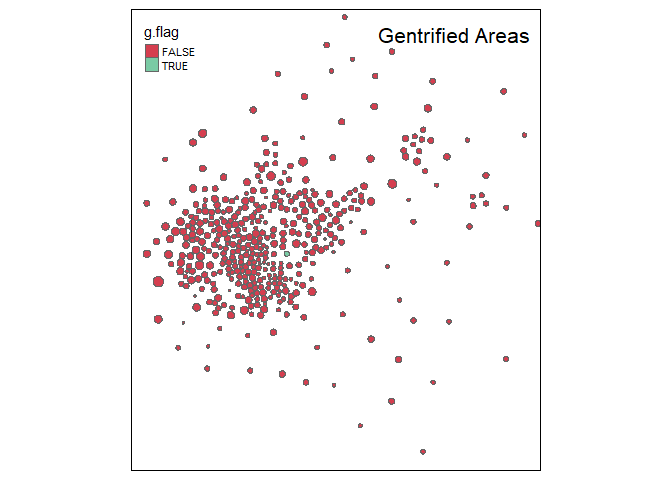

This chapter focuses on describing and visualizing tract data, primarily using Median Home Value as an indicator of neighborhood change. According to Baum-Snow and Hartley (2016), "Estimation of a neighborhood choice model shows that changes in choices to live in central neighborhoods primarily reflect a shifting balance between rising home prices and valuations of local amenities..." This indicates a metric such as Median Home value is a meaningful predictor on neighborhood change. 

Library
==============================

    library( dplyr )
    library( knitr )
    library( pander )
    library( stargazer )
    library( scales )
    library( here )
    library( geojsonio )  # read geoJSON map files from GitHub
    library( sp )         # spatial data class sp for shapefiles
    library( cartogram )  # spatial maps w/ tract size bias reduction
    library( tmap )       # thematic maps
    library( maptools )   # spatial object manipulation 
    library( sf )         # 'simple features' flavor of shapefiles
    library( tidyverse )     # data wrangling
    library( tidycensus )  # pull census data
    library( RColorBrewer )  # color shapefile
    library( zoom )          # enlarge plot

    s.type <- "html"  

    d1 <- readRDS( here::here( "data/rodeo/LTDB-1990.rds" ) )
    d2 <- readRDS( here::here( "data/rodeo/LTDB-2000.rds" ) )
    md <- readRDS( here::here( "data/rodeo/LTDB-META-DATA.rds" ) )

    nrow( d1 ) 

    ## [1] 72693

    import::here("compare_dfs",
                 "d_sub",
                 "MVH.Hist",
                 "jplot",
                 "mvh_compare",
                 "hg",
                 "gent_var",
                 .from = here::here("analysis/source_file_rn.R"),
                 .character_only = TRUE)

Part 1 - Change in Home Values
==============================

  

In urban areas, home values experienced a slight increase between the
1990-2000 period and 2000-2010. The median value increased by 0.58%
which equates to a median dollar increase of $592.  

    #merge data
    d1 <- select( d1, - year )
    d2 <- select( d2, - year )

    d <- merge( d1, d2, by="tractid" )
    d <- merge( d, md, by="tractid" )

    nrow( d )

    ## [1] 72693

    #Only Urban Tracts
    d <- filter( d, urban == "urban" )

    #Compare shared variables
    vars <- compare_dfs( df1=d1, df2=d2 )

    ## [1] "SHARED VARIABLES:"
    ##   [1] "a15asn"  "a15blk"  "a15hsp"  "a15ntv"  "a15wht"  "a18und"  "a60asn" 
    ##   [8] "a60blk"  "a60hsp"  "a60ntv"  "a60up"   "a60wht"  "a75up"   "ag15up" 
    ##  [15] "ag25up"  "ag5up"   "ageasn"  "ageblk"  "agehsp"  "agentv"  "agewht" 
    ##  [22] "asian"   "china"   "clf"     "cni16u"  "col"     "cuban"   "dapov"  
    ##  [29] "dbpov"   "dflabf"  "dfmpov"  "dhpov"   "dis"     "dmulti"  "dnapov" 
    ##  [36] "dpov"    "dwpov"   "empclf"  "family"  "fb"      "fhh"     "filip"  
    ##  [43] "flabf"   "geanc"   "gefb"    "h10yrs"  "h30old"  "haw"     "hh"     
    ##  [50] "hha"     "hhb"     "hhh"     "hhw"     "hinc"    "hinca"   "hincb"  
    ##  [57] "hinch"   "hincw"   "hisp"    "hs"      "hu"      "incpc"   "india"  
    ##  [64] "iranc"   "irfb"    "itanc"   "itfb"    "japan"   "korea"   "lep"    
    ##  [71] "manuf"   "mar"     "mex"     "mhmval"  "mrent"   "multi"   "n10imm" 
    ##  [78] "n65pov"  "napov"   "nat"     "nbpov"   "nfmpov"  "nhblk"   "nhpov"  
    ##  [85] "nhwht"   "nnapov"  "npov"    "ntv"     "nwpov"   "ohu"     "olang"  
    ##  [92] "own"     "pop"     "pr"      "prof"    "rent"    "ruanc"   "rufb"   
    ##  [99] "scanc"   "scfb"    "semp"    "tractid" "unemp"   "vac"     "vet"    
    ## [106] "viet"    "wds"    
    ## [1] "NOT SHARED:"
    ## [1] "ag16cv"  "ag18cv"  "hu00sp"  "hu90sp"  "ohu00sp" "ohu90sp" "pop90.1"

    head(vars)

    ##     type variables
    ## 1 shared    a15asn
    ## 2 shared    a15blk
    ## 3 shared    a15hsp
    ## 4 shared    a15ntv
    ## 5 shared    a15wht
    ## 6 shared    a18und

    #Copy of dataset
    d.full <- d

    #Create subset for the analysis
    d <- d_sub(d)
    head(d)

    ##              tractid mhmval90 mhmval00   hinc90      hu90     own90   rent90
    ## 1 fips-01-001-020100  62200.0  76600.0 27375.00  670.9911  459.9939 164.9978
    ## 2 fips-01-001-020200  43600.0  72900.0 19000.00  692.0000  438.0000 207.0000
    ## 3 fips-01-001-020300  55200.0  79900.0 29419.00 1083.0000  740.0000 307.0000
    ## 4 fips-01-001-020400  67300.0  89800.0 37891.00 1694.0000 1291.0000 328.0000
    ## 5 fips-01-001-020500  74583.1 116593.5 41412.08  761.1411  577.2106 147.7421
    ## 6 fips-01-001-020600  56800.0  70400.0 29000.00 1162.3446  862.0723 246.9982
    ##    empclf90     clf90   unemp90   prof90   dpov90   npov90 ag25up90     hs90
    ## 1  862.9886  893.9882  30.99959 214.9972 1860.975 183.9976 1129.985  680.991
    ## 2  828.0000  910.0000  82.00000 149.0000 1926.000 382.0000 1138.000  816.000
    ## 3 1360.0000 1452.0000  92.00000 261.0000 2904.000 331.0000 1916.000 1156.000
    ## 4 2188.0000 2291.0000 103.00000 630.0000 4389.000 298.0000 2903.000 1322.000
    ## 5 1104.1089 1139.0789  34.96993 327.4383 2158.388 119.4787 1330.083  424.751
    ## 6 1543.0124 1666.9959 123.98342 302.2096 3305.902 588.9213 1894.622 1267.924
    ##      col90  pop90.x  nhwht90    nhblk90   hisp90   asian90  cbsa       cbsaname
    ## 1 225.9970 1772.977 1698.978   36.99951 23.99968  8.999881 33860 Montgomery, AL
    ## 2 146.0000 2031.000  747.000 1260.00000  6.00000 11.000000 33860 Montgomery, AL
    ## 3 270.0000 2952.000 2521.000  405.00000  8.00000 16.000000 33860 Montgomery, AL
    ## 4 639.0000 4401.000 4296.000   36.00000 24.00000 29.000000 33860 Montgomery, AL
    ## 5 397.4642 2135.967 2002.339   86.89748 26.38486 17.620240 33860 Montgomery, AL
    ## 6 193.7241 3312.682 2562.970  708.06158 28.08999  6.780344 33860 Montgomery, AL
    ##    p.white    p.black    p.hisp   p.asian     p.hs    p.col   p.prof  p.unemp
    ## 1 95.82628  2.0868584 1.3536379 0.5076142 80.26549 20.00000 24.91309 3.467562
    ## 2 36.77991 62.0384039 0.2954210 0.5416051 84.53427 12.82953 17.99517 9.010989
    ## 3 85.39973 13.7195121 0.2710027 0.5420054 74.42589 14.09186 19.19118 6.336088
    ## 4 97.61418  0.8179959 0.5453306 0.6589412 67.55081 22.01171 28.79342 4.495853
    ## 5 93.74392  4.0682968 1.2352655 0.8249303 61.81685 29.88267 29.65634 3.070018
    ## 6 77.36842 21.3742692 0.8479532 0.2046784 77.14724 10.22495 19.58569 7.437536
    ##    pov.rate
    ## 1  9.887158
    ## 2 19.833852
    ## 3 11.398072
    ## 4  6.789702
    ## 5  5.535551
    ## 6 17.814240

    #1990-2000 Inflation Rate
    (1.028)^10

    ## [1] 1.318048

    # adjust 1990 home values for inflation 
    mhv.90 <- d$mhmval90 * 1.318048  
    mhv.00 <- d$mhmval00

    mhv.change <- mhv.00 - mhv.90

    df <- data.frame( MedianHomeValue1990=mhv.90, 
                      MedianHomeValue2000=mhv.00, 
                      Change.90.to.00=mhv.change )

    #Histogram change in home values
    MVH.Hist()

    #Compare 1990 and 2000 mhv distributions
    mvh_compare()

    #percent change
    mhv.90[ mhv.90 < 10000 ] <- NA
    pct.change <- mhv.change / mhv.90
    summary( pct.change )

    ##     Min.  1st Qu.   Median     Mean  3rd Qu.     Max.     NA's 
    ## -1.00000 -0.15817  0.00585  0.05175  0.20400 28.36600      145

    # how many cases had increases above 500%
    sum( pct.change > 5, na.rm=T )

    ## [1] 26

    # preview tracts with large increases in home values 
    # to see if increases make sense 

    d %>% 
      filter( pct.change > 5 ) %>% 
      head()

    ##              tractid mhmval90  mhmval00    hinc90      hu90     own90   rent90
    ## 1 fips-01-097-000402 67488.60  593426.5  4999.014  673.0189 15.003853 651.0111
    ## 2 fips-04-019-000100 73035.87  625000.0  5059.955  457.5807 22.886298 382.3900
    ## 3 fips-12-099-002600 63800.00  625000.0 15820.000  242.0000 20.000000 188.0000
    ## 4 fips-13-121-002100 32500.00  261100.0  4999.000 1080.0000  8.000000 999.0000
    ## 5 fips-17-031-842200 21601.50  281775.9  6861.296 1239.2981  9.245283 738.5132
    ## 6 fips-17-167-001400 55000.00 1000001.0  8927.000  678.0000  4.000000 590.0000
    ##   empclf90    clf90   unemp90    prof90    dpov90   npov90  ag25up90      hs90
    ## 1 293.0073 535.0116 242.00434  14.00054 2139.0431 1857.030  812.0255  665.0209
    ## 2 162.6119 181.9220  19.31012  40.20623  581.4132  358.757  498.2508  312.9027
    ## 3 448.0000 448.0000   0.00000  62.00000  575.0000  120.000  527.0000  421.0000
    ## 4 550.0000 732.0000 182.00000  27.00000 2663.0000 1862.000 1426.0000 1164.0000
    ## 5 261.5132 502.2981 240.78491  41.12830 2430.3019 1945.589 1065.5434  953.4642
    ## 6 294.0000 328.0000  34.00000 126.00000  692.0000  247.000  710.0000  408.0000
    ##        col90  pop90.x    nhwht90    nhblk90     hisp90   asian90  cbsa
    ## 1   7.001539 2103.043   2.000053 2098.04241   2.000171  1.000000 33660
    ## 2  53.066401  551.761 328.362787   34.91814 171.381069  3.273576 46060
    ## 3   0.000000  550.000 209.999997  290.00000  46.000000  0.000000 48424
    ## 4  80.000000 2706.000 319.999995 2273.00000  19.000000 87.000000 12060
    ## 5  36.294340 2276.774  42.622646 2194.63774  33.875475  0.000000 16974
    ## 6 140.000000  911.000 769.999996  123.00000  10.000000  6.000000 44100
    ##                                cbsaname     p.white  p.black      p.hisp
    ## 1                            Mobile, AL  0.09510281 99.76224  0.09510844
    ## 2                            Tucson, AZ 59.51177843  6.32849 31.06074328
    ## 3 West Palm Beach-Boca Raton-Boynton FL 38.18181819 52.72727  8.36363649
    ## 4    Atlanta-Sandy Springs-Marietta, GA 11.82557280 83.99852  0.70214340
    ## 5         Chicago-Naperville-Joliet, IL  1.87206343 96.39244  1.48787190
    ## 6                       Springfield, IL 84.52250275 13.50165  1.09769485
    ##      p.asian     p.hs      p.col    p.prof  p.unemp pov.rate
    ## 1 0.04755015 82.75879  0.8622314  4.778222 45.23347 86.81593
    ## 2 0.59329594 73.45078 10.6505405 24.725268 10.61450 61.70431
    ## 3 0.00000000 79.88615  0.0000000 13.839286  0.00000 20.86957
    ## 4 3.21507766 87.23703  5.6100983  4.909091 24.86339 69.92114
    ## 5 0.00000000 92.88767  3.4061813 15.727046 47.93665 80.05543
    ## 6 0.65861691 77.18310 19.7183100 42.857143 10.36585 35.69364

    #Plot the percent change variable
    hg()

    #Group Growth Rates By Metro Area
    d$mhv.change <- mhv.change 
    d$pct.change <- pct.change
    d$mhv.00 <- mhv.00
    d$mhv.90 <- mhv.90

    d %>%
      group_by( cbsaname ) %>%
      summarize( ave.change = median( mhv.change, na.rm=T ),
                 ave.change.d = dollar( round(ave.change,0) ),
                 growth = 100 * median( pct.change, na.rm=T ) ) %>%
      ungroup() %>%
      arrange( - growth ) %>%
      select( - ave.change ) %>% 
      head( 25 ) %>%
      pander()

<table style="width:78%;">
<colgroup>
<col style="width: 44%" />
<col style="width: 20%" />
<col style="width: 12%" />
</colgroup>
<thead>
<tr class="header">
<th style="text-align: center;">cbsaname</th>
<th style="text-align: center;">ave.change.d</th>
<th style="text-align: center;">growth</th>
</tr>
</thead>
<tbody>
<tr class="odd">
<td style="text-align: center;">Corvallis, OR</td>
<td style="text-align: center;">$73,524</td>
<td style="text-align: center;">75.68</td>
</tr>
<tr class="even">
<td style="text-align: center;">Portland-Vancouver-Beaverton, OR-WA</td>
<td style="text-align: center;">$68,168</td>
<td style="text-align: center;">72.05</td>
</tr>
<tr class="odd">
<td style="text-align: center;">Salt Lake City, UT</td>
<td style="text-align: center;">$61,202</td>
<td style="text-align: center;">69.28</td>
</tr>
<tr class="even">
<td style="text-align: center;">Boulder, CO</td>
<td style="text-align: center;">$94,628</td>
<td style="text-align: center;">68.8</td>
</tr>
<tr class="odd">
<td style="text-align: center;">Provo-Orem, UT</td>
<td style="text-align: center;">$60,288</td>
<td style="text-align: center;">68.09</td>
</tr>
<tr class="even">
<td style="text-align: center;">Salem, OR</td>
<td style="text-align: center;">$48,832</td>
<td style="text-align: center;">61.51</td>
</tr>
<tr class="odd">
<td style="text-align: center;">Eugene-Springfield, OR</td>
<td style="text-align: center;">$51,197</td>
<td style="text-align: center;">61.35</td>
</tr>
<tr class="even">
<td style="text-align: center;">Fort Collins-Loveland, CO</td>
<td style="text-align: center;">$57,354</td>
<td style="text-align: center;">56.54</td>
</tr>
<tr class="odd">
<td style="text-align: center;">Longview, WA</td>
<td style="text-align: center;">$40,847</td>
<td style="text-align: center;">55.29</td>
</tr>
<tr class="even">
<td style="text-align: center;">Missoula, MT</td>
<td style="text-align: center;">$45,632</td>
<td style="text-align: center;">54.58</td>
</tr>
<tr class="odd">
<td style="text-align: center;">Jackson, MI</td>
<td style="text-align: center;">$28,290</td>
<td style="text-align: center;">53.64</td>
</tr>
<tr class="even">
<td style="text-align: center;">Greeley, CO</td>
<td style="text-align: center;">$41,565</td>
<td style="text-align: center;">51.91</td>
</tr>
<tr class="odd">
<td style="text-align: center;">Wenatchee, WA</td>
<td style="text-align: center;">$45,825</td>
<td style="text-align: center;">50.67</td>
</tr>
<tr class="even">
<td style="text-align: center;">Detroit-Livonia-Dearborn, MI</td>
<td style="text-align: center;">$28,771</td>
<td style="text-align: center;">49.6</td>
</tr>
<tr class="odd">
<td style="text-align: center;">Yakima, WA</td>
<td style="text-align: center;">$30,900</td>
<td style="text-align: center;">49.56</td>
</tr>
<tr class="even">
<td style="text-align: center;">Ogden-Clearfield, UT</td>
<td style="text-align: center;">$42,331</td>
<td style="text-align: center;">48.73</td>
</tr>
<tr class="odd">
<td style="text-align: center;">Denver-Aurora, CO</td>
<td style="text-align: center;">$52,180</td>
<td style="text-align: center;">48.16</td>
</tr>
<tr class="even">
<td style="text-align: center;">Monroe, MI</td>
<td style="text-align: center;">$42,152</td>
<td style="text-align: center;">47.6</td>
</tr>
<tr class="odd">
<td style="text-align: center;">Bay City, MI</td>
<td style="text-align: center;">$26,740</td>
<td style="text-align: center;">47.26</td>
</tr>
<tr class="even">
<td style="text-align: center;">Logan, UT-ID</td>
<td style="text-align: center;">$35,664</td>
<td style="text-align: center;">46.65</td>
</tr>
<tr class="odd">
<td style="text-align: center;">Eau Claire, WI</td>
<td style="text-align: center;">$27,874</td>
<td style="text-align: center;">43.23</td>
</tr>
<tr class="even">
<td style="text-align: center;">Madison, WI</td>
<td style="text-align: center;">$43,012</td>
<td style="text-align: center;">42.35</td>
</tr>
<tr class="odd">
<td style="text-align: center;">Sioux Falls, SD</td>
<td style="text-align: center;">$31,148</td>
<td style="text-align: center;">41.32</td>
</tr>
<tr class="even">
<td style="text-align: center;">Grand Junction, CO</td>
<td style="text-align: center;">$34,413</td>
<td style="text-align: center;">41.11</td>
</tr>
<tr class="odd">
<td style="text-align: center;">Mount Vernon-Anacortes, WA a</td>
<td style="text-align: center;">$42,068</td>
<td style="text-align: center;">40.81</td>
</tr>
</tbody>
</table>

Part 2 - Measuring
==================

  

Between the 1990-2000 period and 2000-2010 there were 17,670 candidates
for gentrification, and of those 871 transitioned into the advanced
stages of gentrification. The candidates were determined if there was a
lower than average home value and higher than average diversity. These
criteria were selected as gentrification historically takes place in
these poorer areas inhabited largely by marginalized racial groups. Of
the candidates, the number that were determined to have transitioned
into the advanced stages of gentrification experienced above average
rise in home values, growth rate, and a loss of diversity. This criteria
was selected as in gentrified areas home values would go from the low
end of the spectrum to the higher end at a rate that would not otherwise
occur in that relatively short amount of time. Growth rate would follow
a similar trend to home values as development is more likely to in a
less impoverished area. Loss of diversity would indicate the
marginalized groups that previously lived there were displaced by whites
who have become the more predominant ethnic group.  
  

    d.full$mhv.90 <- mhv.90
    d.full$mhv.00 <- mhv.00
    d.full$mhv.change <- mhv.change
    d.full$pct.change <- pct.change

    d3 <- gent_var()

    d3 <- data.frame(d3)
    stargazer( d3, 
               type=s.type, 
               digits=0, 
               summary.stat = c("min", "p25","median","mean","p75","max") )

<table style="text-align:center">
<tr>
<td colspan="7" style="border-bottom: 1px solid black">
</td>
</tr>
<tr>
<td style="text-align:left">
Statistic
</td>
<td>
Min
</td>
<td>
Pctl(25)
</td>
<td>
Median
</td>
<td>
Mean
</td>
<td>
Pctl(75)
</td>
<td>
Max
</td>
</tr>
<tr>
<td colspan="7" style="border-bottom: 1px solid black">
</td>
</tr>
<tr>
<td style="text-align:left">
mhv.90
</td>
<td>
11,694
</td>
<td>
77,765
</td>
<td>
114,143
</td>
<td>
148,508
</td>
<td>
187,163
</td>
<td>
659,025
</td>
</tr>
<tr>
<td style="text-align:left">
mhv.00
</td>
<td>
0
</td>
<td>
81,600
</td>
<td>
119,900
</td>
<td>
144,738
</td>
<td>
173,894
</td>
<td>
1,000,001
</td>
</tr>
<tr>
<td style="text-align:left">
mhv.change
</td>
<td>
-659,025
</td>
<td>
-23,190
</td>
<td>
537
</td>
<td>
-3,902
</td>
<td>
19,132
</td>
<td>
963,755
</td>
</tr>
<tr>
<td style="text-align:left">
pct.change
</td>
<td>
-1
</td>
<td>
-0
</td>
<td>
0
</td>
<td>
0
</td>
<td>
0
</td>
<td>
28
</td>
</tr>
<tr>
<td style="text-align:left">
p.white.90
</td>
<td>
0
</td>
<td>
64
</td>
<td>
87
</td>
<td>
74
</td>
<td>
95
</td>
<td>
100
</td>
</tr>
<tr>
<td style="text-align:left">
p.black.90
</td>
<td>
0
</td>
<td>
1
</td>
<td>
3
</td>
<td>
12
</td>
<td>
10
</td>
<td>
100
</td>
</tr>
<tr>
<td style="text-align:left">
p.hisp.90
</td>
<td>
0
</td>
<td>
1
</td>
<td>
3
</td>
<td>
10
</td>
<td>
9
</td>
<td>
100
</td>
</tr>
<tr>
<td style="text-align:left">
p.asian.90
</td>
<td>
0
</td>
<td>
0
</td>
<td>
1
</td>
<td>
3
</td>
<td>
3
</td>
<td>
94
</td>
</tr>
<tr>
<td style="text-align:left">
p.hs.edu.90
</td>
<td>
0
</td>
<td>
69
</td>
<td>
74
</td>
<td>
74
</td>
<td>
80
</td>
<td>
100
</td>
</tr>
<tr>
<td style="text-align:left">
p.col.edu.90
</td>
<td>
0
</td>
<td>
10
</td>
<td>
18
</td>
<td>
22
</td>
<td>
30
</td>
<td>
100
</td>
</tr>
<tr>
<td style="text-align:left">
p.prof.90
</td>
<td>
0
</td>
<td>
17
</td>
<td>
25
</td>
<td>
27
</td>
<td>
34
</td>
<td>
100
</td>
</tr>
<tr>
<td style="text-align:left">
p.unemp.90
</td>
<td>
0
</td>
<td>
4
</td>
<td>
5
</td>
<td>
7
</td>
<td>
8
</td>
<td>
64
</td>
</tr>
<tr>
<td style="text-align:left">
pov.rate.90
</td>
<td>
0
</td>
<td>
4
</td>
<td>
8
</td>
<td>
12
</td>
<td>
16
</td>
<td>
100
</td>
</tr>
<tr>
<td style="text-align:left">
p.white.00
</td>
<td>
0
</td>
<td>
47
</td>
<td>
78
</td>
<td>
67
</td>
<td>
91
</td>
<td>
100
</td>
</tr>
<tr>
<td style="text-align:left">
p.black.00
</td>
<td>
0
</td>
<td>
1
</td>
<td>
4
</td>
<td>
14
</td>
<td>
14
</td>
<td>
100
</td>
</tr>
<tr>
<td style="text-align:left">
p.hisp.00
</td>
<td>
0
</td>
<td>
2
</td>
<td>
4
</td>
<td>
13
</td>
<td>
15
</td>
<td>
100
</td>
</tr>
<tr>
<td style="text-align:left">
p.asian.00
</td>
<td>
0
</td>
<td>
1
</td>
<td>
2
</td>
<td>
5
</td>
<td>
5
</td>
<td>
95
</td>
</tr>
<tr>
<td style="text-align:left">
p.hs.edu.00
</td>
<td>
0
</td>
<td>
67
</td>
<td>
72
</td>
<td>
72
</td>
<td>
77
</td>
<td>
100
</td>
</tr>
<tr>
<td style="text-align:left">
p.col.edu.00
</td>
<td>
0
</td>
<td>
12
</td>
<td>
21
</td>
<td>
26
</td>
<td>
36
</td>
<td>
100
</td>
</tr>
<tr>
<td style="text-align:left">
p.prof.00
</td>
<td>
0
</td>
<td>
23
</td>
<td>
31
</td>
<td>
34
</td>
<td>
43
</td>
<td>
100
</td>
</tr>
<tr>
<td style="text-align:left">
p.unemp.00
</td>
<td>
0
</td>
<td>
3
</td>
<td>
5
</td>
<td>
6
</td>
<td>
8
</td>
<td>
100
</td>
</tr>
<tr>
<td style="text-align:left">
pov.rate.00
</td>
<td>
0
</td>
<td>
4
</td>
<td>
9
</td>
<td>
12
</td>
<td>
17
</td>
<td>
100
</td>
</tr>
<tr>
<td style="text-align:left">
metro.mhv.pct.90
</td>
<td>
1
</td>
<td>
20
</td>
<td>
41
</td>
<td>
45
</td>
<td>
68
</td>
<td>
100
</td>
</tr>
<tr>
<td style="text-align:left">
metro.mhv.pct.00
</td>
<td>
1
</td>
<td>
20
</td>
<td>
41
</td>
<td>
45
</td>
<td>
68
</td>
<td>
100
</td>
</tr>
<tr>
<td style="text-align:left">
metro.median.pay.90
</td>
<td>
14,871
</td>
<td>
28,906
</td>
<td>
32,457
</td>
<td>
32,924
</td>
<td>
35,833
</td>
<td>
52,374
</td>
</tr>
<tr>
<td style="text-align:left">
metro.median.pay.00
</td>
<td>
23,012
</td>
<td>
39,457
</td>
<td>
43,139
</td>
<td>
45,054
</td>
<td>
49,522
</td>
<td>
73,701
</td>
</tr>
<tr>
<td style="text-align:left">
metro.mhv.pct.change
</td>
<td>
-99
</td>
<td>
-5
</td>
<td>
0
</td>
<td>
0
</td>
<td>
6
</td>
<td>
99
</td>
</tr>
<tr>
<td style="text-align:left">
pay.change
</td>
<td>
4,930
</td>
<td>
9,775
</td>
<td>
11,441
</td>
<td>
12,130
</td>
<td>
14,001
</td>
<td>
26,211
</td>
</tr>
<tr>
<td style="text-align:left">
race.change
</td>
<td>
-100
</td>
<td>
-12
</td>
<td>
-5
</td>
<td>
-8
</td>
<td>
-2
</td>
<td>
100
</td>
</tr>
<tr>
<td style="text-align:left">
metro.race.rank.90
</td>
<td>
1
</td>
<td>
20
</td>
<td>
41
</td>
<td>
45
</td>
<td>
68
</td>
<td>
100
</td>
</tr>
<tr>
<td colspan="7" style="border-bottom: 1px solid black">
</td>
</tr>
</table>

    # home value in lower than average home in a metro in 1990
    poor.1990 <- d3$metro.mhv.pct.90 < 45  

    # above average diversity for metro
    diverse.1990 <- d3$metro.race.rank.90 > 45 

    # home values increased more than overall city gains 
    # change in percentile rank within the metro
    mhv.pct.increase <- d3$metro.mhv.pct.change > 0

    # faster than average growth  
    # 0.58% growth in value is median for the country
    home.val.rise <- d3$pct.change > 0.58 

    # proportion of whites increases by more than mean 
    # measured by increase in white
    loss.diversity <- d3$race.change > -8

    d$g.can <- poor.1990 & diverse.1990
    d$g.flag <- poor.1990 & diverse.1990 & mhv.pct.increase & home.val.rise & loss.diversity

    num.candidates <-  sum( poor.1990 & diverse.1990, na.rm=T )
    num.gentrified <- sum( d$g.flag, na.rm=T )

    num.gentrified

    ## [1] 871

    num.candidates

    ## [1] 17670

Part 3 - Spatial Patterns
=========================

/

Data
----

    # Load Crosswalk data
    crosswalk <- read.csv( "https://raw.githubusercontent.com/DS4PS/cpp-529-master/master/data/cbsatocountycrosswalk.csv",  stringsAsFactors=F, colClasses="character" )

    # search for city names by strings, use the ^ anchor for "begins with" 
    grep( "^SAN AN", crosswalk$msaname, value=TRUE )

    # Download a Shapefile with Population Data
    these.sant <- crosswalk$msaname == "SAN ANTONIO, TX"
    these.fips <- crosswalk$fipscounty[ these.sant ]
    these.fips <- na.omit( these.fips )

    state.fips <- substr( these.fips, 1, 2 )
    county.fips <- substr( these.fips, 3, 5 )

    # Select population data for Texas (state code 48), geometry = TRUE pulls shapefile for TX
    sant.pop <- get_acs( geography = "tract", variables = "B01003_001",
               state = "48", county = county.fips[state.fips=="48"], geometry = TRUE ) %>% 
               select( GEOID, estimate ) %>%
               rename( POP = estimate )

    # Load rodeo data set
    census.dat <- d #census data has already been imported from source file

    # Extract state codes
    census.dat$GEOID <- substr( census.dat$tractid, 6, 18 )  # extract codes
    census.dat$GEOID <- gsub( "-", "", census.dat$GEOID )    # remove hyphens
    class( census.dat$GEOID )

    # can merge an sf object and data.frame
    sant <- merge( sant.pop, census.dat, by.x="GEOID", by.y="GEOID" )

    # make sure there are no empty polygons
    sant <- sant[ ! st_is_empty( sant ) , ]

Choropleth Map Creation
-----------------------

    # convert shapefile map object to a spatial version
    sant.sp <- as_Spatial( sant )

    # Check that it is a SpatialPolygonsDataFrame
    class( sant.sp )

    # project map and remove empty tracts
    sant.sp <- spTransform( sant.sp, CRS("+init=epsg:3395"))
    sant.sp <- sant.sp[ sant.sp$POP != 0 & (! is.na( sant.sp$POP )) , ]

    # convert census tract polygons to dorling cartogram
    # no idea why k=0.03 works, but it does - default is k=5
    sant.sp$pop.w <- sant.sp$POP / 9000 
    sant_dorling <- cartogram_dorling( x=sant.sp, weight="pop.w", k=0.05 )

    # user-defined bounding box to move slocer to subjects 
    bb <- st_bbox( c( xmin =  -10998490, xmax = -10890275, 
                      ymax = 3356190, ymin = 3478288 ), 
                   crs = st_crs("+init=epsg:3395"))

    tm_shape( sant_dorling, bbox=bb ) + 
      tm_polygons( col="mhmval00", n=10, style="quantile", palette="Spectral" ) +
      tm_layout( "Dorling Cartogram", title.position=c("right","top") )

Question 1: Describe the distribution of home values in 1990 - where are high and low-value tracts located in the city/cities?
------------------------------------------------------------------------------------------------------------------------------

**Answer: The highest values homes are located in the northern part of
the San Antonio MSA.**

Question 2: Compare values in 2000 to changes in values from 1990-2000. Do the largest gains occur in tracts with above or below-average home prices in 2000?
-------------------------------------------------------------------------------------------------------------------------------------------------------------

**Answer: In 2000 the high-value tracts expanded going further into the
metro area center. The largest gains were in these high-value adjacent
tracts, although there were some tracts towards the city center that saw
similar gains.**

    #Home Value Change
    tm_shape( sant_dorling, bbox=bb ) + 
      tm_polygons( col="mhv.change", n=10, style="quantile", palette="Spectral" ) +
      tm_layout( "Home Value Change", title.position=c("right","top") )

Question 3: Create a map that highlights tracts that are candidates for gentrification in 2000 and tracts that gentrify between 1990 and 2000. Do you find any meaningful patterns in where gentrification occurs?
------------------------------------------------------------------------------------------------------------------------------------------------------------------------------------------------------------------

**Answer: Where gentrification occurs appears to relate to a tract’s
proximity to tracts with higher home values. The tracts where
gentrification occur tend to be on the outskirts of the city and either
adjacent to or surrounded by tracts with a higher initial home value.**

    #Gentrification Candidates
    tm_shape( sant_dorling, bbox=bb ) + 
      tm_polygons( col="g.can", n=10, style="cat", palette="Spectral" ) +
      tm_layout( "Gentrification Candidates", title.position=c("right","top") )

    #Gentrified Areas
    tm_shape( sant_dorling, bbox=bb ) + 
      tm_polygons( col="g.flag", n=10, style="cat", palette="Spectral" ) +
      tm_layout( "Gentrified Areas", title.position=c("right","top") )

