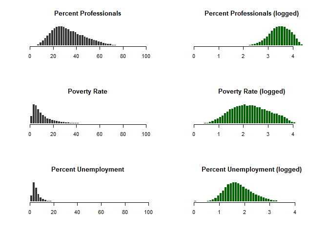
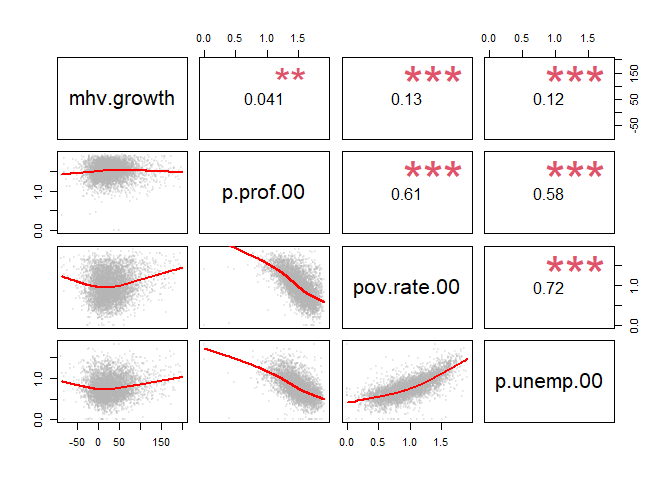

Part 1 - Data
=============

The following data steps are now completed in the source\_file\_rn.R:

    - Similar to your previous lab, create a dataset that includes 2000 and 2010 census variables drop all rural census tracts.
    - Create a variable that measures the growth of median home value from 2000 to 2010.
    - Omit cases that have a median home value less than $10,000 in 2000.
    - Omit cases with growth rates above 200%.

Load necessary packages:
------------------------

    library( dplyr )
    library( here )
    library( knitr )
    library( pander )
    library( stargazer )
    library( scales )
    library( plm )
    library( evaluate )

Load wrangled datasets and prepare variables for analysis:
----------------------------------------------------------

    # load necessary functions and objects ----
    # note: all of these are R objects that will be used throughout this .rmd file
    import::here("S_TYPE",
                 "panel.cor",
                 "panel.smooth",
                 "jplot",
                 "d",
                 "df",
                 "cbsa_stats_df",
                 "mhv.00",
                 # notice the use of here::here() that points to the .R file
                 # where all these R objects are created
                 .from = here::here("labs/wk06/source_file_rn.R"),
                 .character_only = TRUE)

    df %>% head()

    ##   MedianHomeValue2000 MedianHomeValue2010 MHV.Change.00.to.10
    ## 1            98702.93              121500            22797.07
    ## 2            93935.30              130500            36564.70
    ## 3           102955.15              118700            15744.85
    ## 4           115711.79              133500            17788.21
    ## 5           150236.59              174500            24263.41
    ## 6            90713.92              129600            38886.08
    ##   MHV.Growth.00.to.12
    ## 1            23.09665
    ## 2            38.92542
    ## 3            15.29293
    ## 4            15.37286
    ## 5            16.15013
    ## 6            42.86672

Descriptives
------------

    stargazer( df, 
               type = S_TYPE, 
               digits = 0, 
               summary.stat = c("min", "p25","median","mean","p75","max") )

<table style="text-align:center">
<tr>
<td colspan="7" style="border-bottom: 1px solid black">
</td>
</tr>
<tr>
<td style="text-align:left">
Statistic
</td>
<td>
Min
</td>
<td>
Pctl(25)
</td>
<td>
Median
</td>
<td>
Mean
</td>
<td>
Pctl(75)
</td>
<td>
Max
</td>
</tr>
<tr>
<td colspan="7" style="border-bottom: 1px solid black">
</td>
</tr>
<tr>
<td style="text-align:left">
MedianHomeValue2000
</td>
<td>
11,167
</td>
<td>
105,661
</td>
<td>
154,903
</td>
<td>
187,129
</td>
<td>
224,337
</td>
<td>
1,288,551
</td>
</tr>
<tr>
<td style="text-align:left">
MedianHomeValue2010
</td>
<td>
9,999
</td>
<td>
123,200
</td>
<td>
193,200
</td>
<td>
246,570
</td>
<td>
312,000
</td>
<td>
1,000,001
</td>
</tr>
<tr>
<td style="text-align:left">
MHV.Change.00.to.10
</td>
<td>
-1,228,651
</td>
<td>
7,187
</td>
<td>
36,268
</td>
<td>
60,047
</td>
<td>
94,881
</td>
<td>
1,000,001
</td>
</tr>
<tr>
<td style="text-align:left">
MHV.Growth.00.to.12
</td>
<td>
-97
</td>
<td>
6
</td>
<td>
25
</td>
<td>
33
</td>
<td>
50
</td>
<td>
6,059
</td>
</tr>
<tr>
<td colspan="7" style="border-bottom: 1px solid black">
</td>
</tr>
</table>

Metro Level Statistics
----------------------

    # view results
    cbsa_stats_df %>% head()

    ## # A tibble: 6 x 3
    ##   cbsaname                    metro.mhv.change metro.mhv.growth
    ##   <chr>                                  <dbl>            <dbl>
    ## 1 Abilene, TX                           10305.            1814.
    ## 2 Akron, OH                            -10646.            -887.
    ## 3 Albany-Schenectady-Troy, NY           54413.            4176.
    ## 4 Albany, GA                             5547.             646.
    ## 5 Albuquerque, NM                       27630.            1823.
    ## 6 Alexandria, LA                        23195.            3289.

Part 2 - Predict MHV Change
===========================

Select at least three census variables that you feel will be good predictors of change in MHV between 2000 and 2010.
--------------------------------------------------------------------------------------------------------------------

    - Percent Professionals (p.prof.00)
    - Poverty Rate (pov.rate.00)
    - Percent Unemployment (p.unemp.00)

    # create subset to visualize in correlation matrix 
    d4 <- select( d, mhv.growth, p.prof.00, pov.rate.00,  p.unemp.00 )

    par( mfrow=c(3,2) )

    # Unemployment
    hist( d4$p.prof.00, breaks=50, col="gray20", border="white",
          yaxt="n", xlab="", ylab="", main="Percent Professionals")
    hist( log(d4$p.prof.00+1), breaks=50, col="darkgreen", border="white",
          yaxt="n", xlab="", ylab="", main="Percent Professionals (logged)")
    # Vacant
    hist( d4$pov.rate.00, breaks=50, col="gray20", border="white",
          yaxt="n", xlab="", ylab="", main="Poverty Rate")
    hist( log(d4$pov.rate.00+1), breaks=50, col="darkgreen", border="white",
          yaxt="n", xlab="", ylab="", main="Poverty Rate (logged)")
    # White
    hist( d4$p.unemp.00, breaks=50, col="gray20", border="white",
          yaxt="n", xlab="", ylab="", main="Percent Unemployment")
    hist( log(d4$p.unemp.00+1), breaks=50, col="darkgreen", border="white",
          yaxt="n", xlab="", ylab="", main="Percent Unemployment (logged)")

**The distributions above in green were selected by checking for
variable skew. Log transformations were used to suppress outliers for
all three variables.**

Apply log transformations:
--------------------------

    # reduce data density for visualization
    set.seed( 1234 )

    # recode some vars to remove skew
    d4$p.prof.00 <- log10( d4$p.prof.00 + 1 )
    d4$pov.rate.00 <- log10( d4$pov.rate.00 + 1 )
    d4$p.unemp.00 <- log10( d4$p.unemp.00 + 1 )

    d4.sample <- sample_n( d4, 5000 ) %>% na.omit()

    # correlation plot with transformed variables
    pairs( d4.sample, upper.panel=panel.cor, lower.panel=panel.smooth )

 

Check for multicollinearity:

    d.reg <- d
    d.reg$mhv.growth[ d.reg$mhv.growth > 200 ] <- NA
    d.reg$p.prof.00 <- log10( d.reg$p.prof.00 + 1 )
    d.reg$pov.rate.00 <- log10( d.reg$pov.rate.00 + 1 )
    d.reg$p.unemp.00 <- log10( d.reg$p.unemp.00 + 1 )

    m1 <- lm( mhv.growth ~  pov.rate.00, data=d.reg ) # suspicious variable
    m2 <- lm( mhv.growth ~  p.unemp.00, data=d.reg ) # suspicious variable
    m3 <- lm( mhv.growth ~  pov.rate.00 + p.unemp.00, data=d.reg ) # test for multicollinearity

    stargazer( m1, m2, m3,
               type = S_TYPE, digits = 2,
               omit.stat = c("rsq","f") )

<table style="text-align:center">
<tr>
<td colspan="4" style="border-bottom: 1px solid black">
</td>
</tr>
<tr>
<td style="text-align:left">
</td>
<td colspan="3">
<em>Dependent variable:</em>
</td>
</tr>
<tr>
<td>
</td>
<td colspan="3" style="border-bottom: 1px solid black">
</td>
</tr>
<tr>
<td style="text-align:left">
</td>
<td colspan="3">
mhv.growth
</td>
</tr>
<tr>
<td style="text-align:left">
</td>
<td>
(1)
</td>
<td>
(2)
</td>
<td>
(3)
</td>
</tr>
<tr>
<td colspan="4" style="border-bottom: 1px solid black">
</td>
</tr>
<tr>
<td style="text-align:left">
pov.rate.00
</td>
<td>
12.78\*\*\*
</td>
<td>
</td>
<td>
9.37\*\*\*
</td>
</tr>
<tr>
<td style="text-align:left">
</td>
<td>
(0.42)
</td>
<td>
</td>
<td>
(0.61)
</td>
</tr>
<tr>
<td style="text-align:left">
</td>
<td>
</td>
<td>
</td>
<td>
</td>
</tr>
<tr>
<td style="text-align:left">
p.unemp.00
</td>
<td>
</td>
<td>
15.60\*\*\*
</td>
<td>
6.29\*\*\*
</td>
</tr>
<tr>
<td style="text-align:left">
</td>
<td>
</td>
<td>
(0.56)
</td>
<td>
(0.83)
</td>
</tr>
<tr>
<td style="text-align:left">
</td>
<td>
</td>
<td>
</td>
<td>
</td>
</tr>
<tr>
<td style="text-align:left">
Constant
</td>
<td>
16.76\*\*\*
</td>
<td>
17.34\*\*\*
</td>
<td>
15.28\*\*\*
</td>
</tr>
<tr>
<td style="text-align:left">
</td>
<td>
(0.44)
</td>
<td>
(0.46)
</td>
<td>
(0.48)
</td>
</tr>
<tr>
<td style="text-align:left">
</td>
<td>
</td>
<td>
</td>
<td>
</td>
</tr>
<tr>
<td colspan="4" style="border-bottom: 1px solid black">
</td>
</tr>
<tr>
<td style="text-align:left">
Observations
</td>
<td>
58,557
</td>
<td>
58,557
</td>
<td>
58,557
</td>
</tr>
<tr>
<td style="text-align:left">
Adjusted R2
</td>
<td>
0.02
</td>
<td>
0.01
</td>
<td>
0.02
</td>
</tr>
<tr>
<td style="text-align:left">
Residual Std. Error
</td>
<td>
34.70 (df = 58555)
</td>
<td>
34.76 (df = 58555)
</td>
<td>
34.69 (df = 58554)
</td>
</tr>
<tr>
<td colspan="4" style="border-bottom: 1px solid black">
</td>
</tr>
<tr>
<td style="text-align:left">
<em>Note:</em>
</td>
<td colspan="3" style="text-align:right">
*p&lt;0.1; **p&lt;0.05; ***p&lt;0.01
</td>
</tr>
</table>

 

**Coefficient sizes are smaller, standard errors increased, and the
R-square stayed the same. These indicates that multicollinearity between
the two suspicious variables, Poverty Rate and Percent Unemployment, may
be a concern. This is expected considering that the variables chosen are
different attributes of the same construct - neighborhood home value. **

Run the model while including metro-level fixed effects (cbsa name or FIPS).
----------------------------------------------------------------------------

    model.ols <- lm( mhv.growth ~ p.prof.00 + pov.rate.00 + p.unemp.00, 
                     data = d.reg)

    model.fe <- plm( mhv.growth ~ p.prof.00 + pov.rate.00 + p.unemp.00,
                   index=c("cbsaname"), 
                   data = d.reg)

    stargazer( model.ols, model.fe, 
               type = S_TYPE, 
               dep.var.labels = ("Percent MHV Change"),
               column.labels = c("OLS", "Fixed effects"), 
               intercept.bottom = FALSE,
               omit.stat = "all", 
               digits = 2 )

<table style="text-align:center">
<tr>
<td colspan="3" style="border-bottom: 1px solid black">
</td>
</tr>
<tr>
<td style="text-align:left">
</td>
<td colspan="2">
<em>Dependent variable:</em>
</td>
</tr>
<tr>
<td>
</td>
<td colspan="2" style="border-bottom: 1px solid black">
</td>
</tr>
<tr>
<td style="text-align:left">
</td>
<td colspan="2">
Percent MHV Change
</td>
</tr>
<tr>
<td style="text-align:left">
</td>
<td>
<em>OLS</em>
</td>
<td>
<em>panel</em>
</td>
</tr>
<tr>
<td style="text-align:left">
</td>
<td>
<em></em>
</td>
<td>
<em>linear</em>
</td>
</tr>
<tr>
<td style="text-align:left">
</td>
<td>
OLS
</td>
<td>
Fixed effects
</td>
</tr>
<tr>
<td style="text-align:left">
</td>
<td>
(1)
</td>
<td>
(2)
</td>
</tr>
<tr>
<td colspan="3" style="border-bottom: 1px solid black">
</td>
</tr>
<tr>
<td style="text-align:left">
Constant
</td>
<td>
-53.53\*\*\*
</td>
<td>
</td>
</tr>
<tr>
<td style="text-align:left">
</td>
<td>
(1.89)
</td>
<td>
</td>
</tr>
<tr>
<td style="text-align:left">
</td>
<td>
</td>
<td>
</td>
</tr>
<tr>
<td style="text-align:left">
p.prof.00
</td>
<td>
36.18\*\*\*
</td>
<td>
9.41\*\*\*
</td>
</tr>
<tr>
<td style="text-align:left">
</td>
<td>
(0.96)
</td>
<td>
(0.79)
</td>
</tr>
<tr>
<td style="text-align:left">
</td>
<td>
</td>
<td>
</td>
</tr>
<tr>
<td style="text-align:left">
pov.rate.00
</td>
<td>
18.58\*\*\*
</td>
<td>
14.26\*\*\*
</td>
</tr>
<tr>
<td style="text-align:left">
</td>
<td>
(0.65)
</td>
<td>
(0.54)
</td>
</tr>
<tr>
<td style="text-align:left">
</td>
<td>
</td>
<td>
</td>
</tr>
<tr>
<td style="text-align:left">
p.unemp.00
</td>
<td>
13.43\*\*\*
</td>
<td>
0.23
</td>
</tr>
<tr>
<td style="text-align:left">
</td>
<td>
(0.84)
</td>
<td>
(0.70)
</td>
</tr>
<tr>
<td style="text-align:left">
</td>
<td>
</td>
<td>
</td>
</tr>
<tr>
<td colspan="3" style="border-bottom: 1px solid black">
</td>
</tr>
<tr>
<td colspan="3" style="border-bottom: 1px solid black">
</td>
</tr>
<tr>
<td style="text-align:left">
<em>Note:</em>
</td>
<td colspan="2" style="text-align:right">
*p&lt;0.1; **p&lt;0.05; ***p&lt;0.01
</td>
</tr>
</table>

    # intercept for each cbsa name, only show first 20 
    fixef(model.fe)[1:20]

    ##                        Abilene, TX                          Akron, OH 
    ##                          -7.054979                         -34.533701 
    ##        Albany-Schenectady-Troy, NY                         Albany, GA 
    ##                          14.106656                         -20.198121 
    ##                    Albuquerque, NM                     Alexandria, LA 
    ##                          -8.022383                           1.483466 
    ##  Allentown-Bethlehem-Easton, PA-NJ                        Altoona, PA 
    ##                           9.775334                         -12.497203 
    ##                       Amarillo, TX                           Ames, IA 
    ##                          -2.977027                         -21.736309 
    ##                      Anchorage, AK                       Anderson, IN 
    ##                          17.201883                         -39.684258 
    ##                       Anderson, SC                      Ann Arbor, MI 
    ##                         -15.847401                         -32.518676 
    ##                Anniston-Oxford, AL                       Appleton, WI 
    ##                          -8.090543                         -13.192102 
    ##                      Asheville, NC           Athens-Clarke County, GA 
    ##                          12.911385                           2.139822 
    ##                    Atlan  City, NJ Atlanta-Sandy Springs-Marietta, GA 
    ##                          45.834081                         -18.690242

    pFtest(model.fe, model.ols) 

    ## 
    ##  F test for individual effects
    ## 
    ## data:  mhv.growth ~ p.prof.00 + pov.rate.00 + p.unemp.00
    ## F = 106.14, df1 = 378, df2 = 58175, p-value < 2.2e-16
    ## alternative hypothesis: significant effects

   

What are the results? Which factor was most important? Did it meet your expectations? Were there any variables that were not significant that you expected to be?
-----------------------------------------------------------------------------------------------------------------------------------------------------------------

**According to the fixed effects results model, Percent Professional and
Poverty Rate coefficients were statistically significant. Poverty Rate
had the largest effect on MHV Growth, which matches our expectation
since high poverty rates would indicate individuals living in poverty
may not be able to afford higher valued homes and therefore affecting
the the growth of home values. Percent Unemployment was not significant
though it was expected to be.**

Explain findings to a general audience:
---------------------------------------

**In the MHV Growth fixed effect model, Percent Professional and Poverty
Rate significantly affect MHV Growth. However, we have the problem of
multicollinearity since the variables appear to be correlated with each
other. While the variables chosen each contribute to median home value
growth, Poverty Rate had the largest effect on the MHV Growth.**

   
