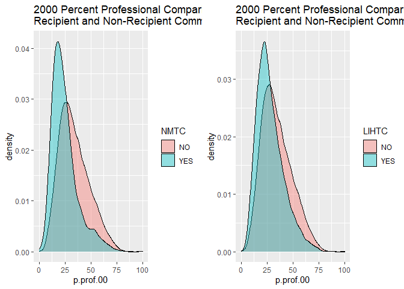
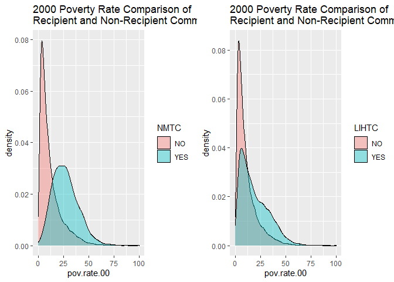
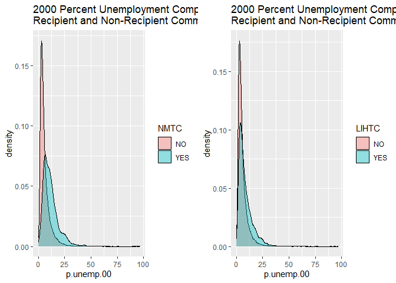
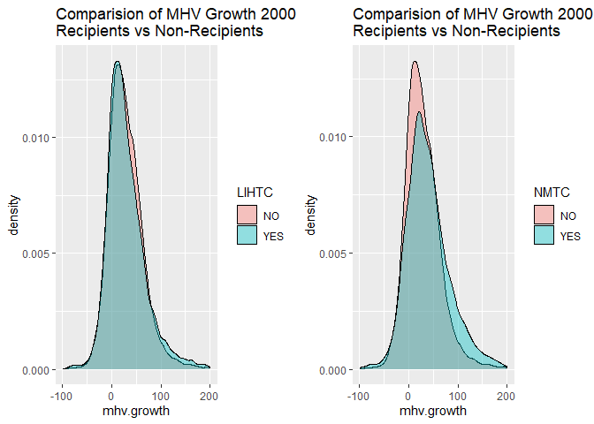

## Overview of Programs

**New Market Tax Credits (NMTC)**
The NMTC program provides a federal tax credit to investors utilizing private investment capital to develop in economically distressed communities. To qualify for the tax credit, investments must meet specified criteria and qualifications. Most investments are made in "Low-Income Communities", which have either a poverty rate of 20 percent or greater, or a median family income at or below 80 percent of the applicable area median family income.

For more information, visit the [NMTC program website](https://www.cdfifund.gov/programs-training/programs/new-markets-tax-credit).

**Low Income Housing Tax Credits (LIHTC)**

The LIHTC supports affordable housing creation in the United States by giving state and local agencies an annual budget to issue tax credits. The tax credits may be used for the rehabilitation of existing affordable housing or building new rental housing targets towards lower-income households.

For more information, visit the [LIHTC program website](https://www.huduser.gov/portal/datasets/lihtc.html).

## Data Sources

NMTC program data can be downloaded [here](https://github.com/DS4PS/cpp-528-spr-2020/blob/master/labs/data/raw/NMTC/nmtc-sheet-01.csv).
LIHTC program data can be downloaded [here](https://lihtc.huduser.gov/).

This project also utilizes United States Census data, which may be accessed via API. API key can be requested [here](https://api.census.gov/data/key_signup.html). 

Library
=======

    library( here )
    library( import )
    library( tidyverse )
    library( pander )
    library( dplyr )
    library( knitr )
    library( stargazer )
    library( scales )

Load Functions
==============

    import::here("S_TYPE",
                 "d",
                 "df",
                 "d3",
                 "PLOTS",
                 "%>%",
                 .from = here::here("labs/wk06/source_file_rn.R"), # here::here() points to the .R file where all these R objects are created
                 .character_only = TRUE)

    detach("package:import", unload = TRUE)

Rodeo Dataset
=============

    # Save data set to rodeo folder
    saveRDS(d, here("data/rodeo/rodeo-data-rn.rds"))

    # Load data set
    readRDS(file = here("data/rodeo/rodeo-data-rn.rds"))

    ## # A tibble: 58,557 x 82
    ##    tractid cbsa  cbsaname mhv.00 mhv.10 mhv.change mhv.growth hinc00  hu00 own00
    ##    <chr>   <chr> <chr>     <dbl>  <dbl>      <dbl>      <dbl>  <dbl> <dbl> <dbl>
    ##  1 fips-0~ 33860 Montgom~ 9.87e4 121500     22797.       23.1 47270.  769.  518.
    ##  2 fips-0~ 33860 Montgom~ 9.39e4 130500     36565.       38.9 39040.  731   452 
    ##  3 fips-0~ 33860 Montgom~ 1.03e5 118700     15745.       15.3 60215. 1263   869 
    ##  4 fips-0~ 33860 Montgom~ 1.16e5 133500     17788.       15.4 59456. 1871  1390 
    ##  5 fips-0~ 33860 Montgom~ 1.50e5 174500     24263.       16.2 75878. 2282. 1671.
    ##  6 fips-0~ 33860 Montgom~ 9.07e4 129600     38886.       42.9 43423. 1310.  961.
    ##  7 fips-0~ 33860 Montgom~ 7.00e4 104200     34232.       48.9 47630. 1348   847 
    ##  8 fips-0~ 33860 Montgom~ 1.23e5 292800    169518.      138.  57696.  733.  583.
    ##  9 fips-0~ 33860 Montgom~ 1.25e5 152500     27382.       21.9 58550. 2939. 2350.
    ## 10 fips-0~ 33860 Montgom~ 8.12e4  95900     14721.       18.1 49663. 1865. 1475.
    ## # ... with 58,547 more rows, and 72 more variables: rent00 <dbl>, hinc12 <dbl>,
    ## #   hu10 <dbl>, own10 <dbl>, rent10 <dbl>, empclf00 <dbl>, clf00 <dbl>,
    ## #   unemp00 <dbl>, prof00 <dbl>, empclf12 <dbl>, clf12 <dbl>, unemp12 <dbl>,
    ## #   prof12 <dbl>, dpov00 <dbl>, npov00 <dbl>, dpov12 <dbl>, npov12 <dbl>,
    ## #   ag25up00 <dbl>, hs00 <dbl>, col00 <dbl>, ag25up12 <dbl>, hs12 <dbl>,
    ## #   col12 <dbl>, pop00.x <dbl>, nhwht00 <dbl>, nhblk00 <dbl>, hisp00 <dbl>,
    ## #   asian00 <dbl>, pop10 <dbl>, nhwht10 <dbl>, nhblk10 <dbl>, hisp10 <dbl>, ...

Data Manifest
=============

    ltdb.raw.2000s <- read.csv( here("data/raw/ltdb_std_2000_sample.csv") )
    ltdb.raw.2000f <- read.csv( here("data/raw/ltdb_std_2000_fullcount.csv") )
    ltdb.rodeo.2000 <- readRDS( file = here("data/rodeo/ltdb-2000.rds") )

    ltdb.raw.2010s <- read.csv( here("data/raw/ltdb_std_2010_sample.csv") )
    ltdb.raw.2010f <- read.csv( here("data/raw/ltdb_std_2010_fullcount.csv") )
    ltdb.rodeo.2010 <- readRDS( file = here("data/rodeo/ltdb-2010.rds") )

    complete.rodeo <- readRDS( file = here("data/rodeo/rodeo-data-rn.rds") )

    nrow( ltdb.raw.2000s ) # 72,693
    nrow( ltdb.raw.2000f ) # 72,693
    nrow( ltdb.rodeo.2000 ) # 72,693

    nrow( ltdb.raw.2010s ) # 73,056
    nrow( ltdb.raw.2010f ) # 74,002
    nrow( ltdb.rodeo.2010 ) #74,022

    nrow( complete.rodeo ) # 59,066

Explain why the number of rows is less
======================================

**Answer: The rodeo data were trimmed to remove rural districts and
tracts with home values below $10,000 in 2000.**

Descriptive Statistics
======================

    stargazer( df,
               type = S_TYPE,
               digits = 0,
               summary.stat = c("min", "p25","median","mean","p75","max") )

<table style="text-align:center">
<tr>
<td colspan="7" style="border-bottom: 1px solid black">
</td>
</tr>
<tr>
<td style="text-align:left">
Statistic
</td>
<td>
Min
</td>
<td>
Pctl(25)
</td>
<td>
Median
</td>
<td>
Mean
</td>
<td>
Pctl(75)
</td>
<td>
Max
</td>
</tr>
<tr>
<td colspan="7" style="border-bottom: 1px solid black">
</td>
</tr>
<tr>
<td style="text-align:left">
MedianHomeValue2000
</td>
<td>
11,167
</td>
<td>
105,661
</td>
<td>
154,903
</td>
<td>
187,129
</td>
<td>
224,337
</td>
<td>
1,288,551
</td>
</tr>
<tr>
<td style="text-align:left">
MedianHomeValue2010
</td>
<td>
9,999
</td>
<td>
123,200
</td>
<td>
193,200
</td>
<td>
246,570
</td>
<td>
312,000
</td>
<td>
1,000,001
</td>
</tr>
<tr>
<td style="text-align:left">
MHV.Change.00.to.10
</td>
<td>
-1,228,651
</td>
<td>
7,187
</td>
<td>
36,268
</td>
<td>
60,047
</td>
<td>
94,881
</td>
<td>
1,000,001
</td>
</tr>
<tr>
<td style="text-align:left">
MHV.Growth.00.to.12
</td>
<td>
-97
</td>
<td>
6
</td>
<td>
25
</td>
<td>
33
</td>
<td>
50
</td>
<td>
6,059
</td>
</tr>
<tr>
<td colspan="7" style="border-bottom: 1px solid black">
</td>
</tr>
</table>

Plots
=====

    ### PERCENT PROFESSIONAL
    gridExtra::grid.arrange( PLOTS$p_prof_2000$nmtc, 
                             PLOTS$p_prof_2000$lihtc, 
                             nrow = 1 )

    ### POVERTY RATES
    gridExtra::grid.arrange( PLOTS$pov_rate_2000$nmtc, 
                             PLOTS$pov_rate_2000$lihtc, 
                             nrow = 1 )

    ### PERCENT UNEMPLOYED
    gridExtra::grid.arrange( PLOTS$p_unemp_2000$nmtc, 
                             PLOTS$p_unemp_2000$lihtc, 
                             nrow = 1 )

    ### MHV Growth Rates (DV in Model)
    gridExtra::grid.arrange( PLOTS$mhv_growth$lihtc, 
                             PLOTS$mhv_growth$nmtc, 
                             nrow = 1 )

Diff-In-Diff Models
===================

    # set randomization seed
    set.seed( 1234 )

    # Model with NMTC data and control variables
    m.nmtc <- lm( y ~ treat.nmtc + post + p.prof + pov.rate + p.unemp + treat.nmtc*post, data = d3 )

    # Model with LIHTC data and control variables
    m.lihtc <- lm( y ~ treat.lihtc + post + p.prof + pov.rate + p.unemp + treat.lihtc*post, data = d3 )

    # Display model results
    stargazer( m.nmtc, m.lihtc,
               type = S_TYPE, 
               column.labels = c("NMTC Model"),
               dep.var.labels = c("Median House Value (log)"),
               covariate.labels = c("Treatment - NMTC",
                                    "Treatment - LIHTC",
                                    "Post Time Period",
                                    "Percent Professionals",
                                    "Poverty Rate",
                                    "Percent Unemployment",
                                    "Treatment x Post - NMTC",
                                    "Treatment x Post - LIHTC"),
               digits = 2 )

<table style="text-align:center">
<tr>
<td colspan="3" style="border-bottom: 1px solid black">
</td>
</tr>
<tr>
<td style="text-align:left">
</td>
<td colspan="2">
<em>Dependent variable:</em>
</td>
</tr>
<tr>
<td>
</td>
<td colspan="2" style="border-bottom: 1px solid black">
</td>
</tr>
<tr>
<td style="text-align:left">
</td>
<td colspan="2">
Median House Value (log)
</td>
</tr>
<tr>
<td style="text-align:left">
</td>
<td>
NMTC Model
</td>
<td>
</td>
</tr>
<tr>
<td style="text-align:left">
</td>
<td>
(1)
</td>
<td>
(2)
</td>
</tr>
<tr>
<td colspan="3" style="border-bottom: 1px solid black">
</td>
</tr>
<tr>
<td style="text-align:left">
Treatment - NMTC
</td>
<td>
0.10\*\*\*
</td>
<td>
</td>
</tr>
<tr>
<td style="text-align:left">
</td>
<td>
(0.01)
</td>
<td>
</td>
</tr>
<tr>
<td style="text-align:left">
</td>
<td>
</td>
<td>
</td>
</tr>
<tr>
<td style="text-align:left">
Treatment - LIHTC
</td>
<td>
</td>
<td>
0.01\*\*
</td>
</tr>
<tr>
<td style="text-align:left">
</td>
<td>
</td>
<td>
(0.01)
</td>
</tr>
<tr>
<td style="text-align:left">
</td>
<td>
</td>
<td>
</td>
</tr>
<tr>
<td style="text-align:left">
Post Time Period
</td>
<td>
0.20\*\*\*
</td>
<td>
0.20\*\*\*
</td>
</tr>
<tr>
<td style="text-align:left">
</td>
<td>
(0.003)
</td>
<td>
(0.003)
</td>
</tr>
<tr>
<td style="text-align:left">
</td>
<td>
</td>
<td>
</td>
</tr>
<tr>
<td style="text-align:left">
Percent Professionals
</td>
<td>
0.02\*\*\*
</td>
<td>
0.02\*\*\*
</td>
</tr>
<tr>
<td style="text-align:left">
</td>
<td>
(0.0001)
</td>
<td>
(0.0001)
</td>
</tr>
<tr>
<td style="text-align:left">
</td>
<td>
</td>
<td>
</td>
</tr>
<tr>
<td style="text-align:left">
Poverty Rate
</td>
<td>
-0.01\*\*\*
</td>
<td>
-0.01\*\*\*
</td>
</tr>
<tr>
<td style="text-align:left">
</td>
<td>
(0.0002)
</td>
<td>
(0.0002)
</td>
</tr>
<tr>
<td style="text-align:left">
</td>
<td>
</td>
<td>
</td>
</tr>
<tr>
<td style="text-align:left">
Percent Unemployment
</td>
<td>
0.001\*\*\*
</td>
<td>
0.001\*\*\*
</td>
</tr>
<tr>
<td style="text-align:left">
</td>
<td>
(0.0003)
</td>
<td>
(0.0003)
</td>
</tr>
<tr>
<td style="text-align:left">
</td>
<td>
</td>
<td>
</td>
</tr>
<tr>
<td style="text-align:left">
Treatment x Post - NMTC
</td>
<td>
0.01
</td>
<td>
</td>
</tr>
<tr>
<td style="text-align:left">
</td>
<td>
(0.02)
</td>
<td>
</td>
</tr>
<tr>
<td style="text-align:left">
</td>
<td>
</td>
<td>
</td>
</tr>
<tr>
<td style="text-align:left">
Treatment x Post - LIHTC
</td>
<td>
</td>
<td>
0.01
</td>
</tr>
<tr>
<td style="text-align:left">
</td>
<td>
</td>
<td>
(0.01)
</td>
</tr>
<tr>
<td style="text-align:left">
</td>
<td>
</td>
<td>
</td>
</tr>
<tr>
<td style="text-align:left">
Constant
</td>
<td>
11.27\*\*\*
</td>
<td>
11.27\*\*\*
</td>
</tr>
<tr>
<td style="text-align:left">
</td>
<td>
(0.01)
</td>
<td>
(0.01)
</td>
</tr>
<tr>
<td style="text-align:left">
</td>
<td>
</td>
<td>
</td>
</tr>
<tr>
<td colspan="3" style="border-bottom: 1px solid black">
</td>
</tr>
<tr>
<td style="text-align:left">
Observations
</td>
<td>
117,114
</td>
<td>
117,114
</td>
</tr>
<tr>
<td style="text-align:left">
R2
</td>
<td>
0.45
</td>
<td>
0.45
</td>
</tr>
<tr>
<td style="text-align:left">
Adjusted R2
</td>
<td>
0.45
</td>
<td>
0.45
</td>
</tr>
<tr>
<td style="text-align:left">
Residual Std. Error (df = 117107)
</td>
<td>
0.48
</td>
<td>
0.48
</td>
</tr>
<tr>
<td style="text-align:left">
F Statistic (df = 6; 117107)
</td>
<td>
15,785.58\*\*\*
</td>
<td>
15,751.79\*\*\*
</td>
</tr>
<tr>
<td colspan="3" style="border-bottom: 1px solid black">
</td>
</tr>
<tr>
<td style="text-align:left">
<em>Note:</em>
</td>
<td colspan="2" style="text-align:right">
*p&lt;0.1; **p&lt;0.05; ***p&lt;0.01
</td>
</tr>
</table>

    # NMTC Coefficients
    b0.nmtc <- m.nmtc$coefficients[1] 
    b1.nmtc <- m.nmtc$coefficients[2]
    b2.nmtc <- m.nmtc$coefficients[3]
    b3.nmtc <- m.nmtc$coefficients[4]

    # LIHTC Coefficients
    b0.lihtc <- m.lihtc$coefficients[1] 
    b1.lihtc <- m.lihtc$coefficients[2]
    b2.lihtc <- m.lihtc$coefficients[3]
    b3.lihtc <- m.lihtc$coefficients[4]

    # calculated post-treatment home values
    T2.nmtc <- exp( b0.nmtc + b1.nmtc + b2.nmtc + b3.nmtc )
    T2.lihtc <- exp( b0.lihtc + b1.lihtc + b2.lihtc + b3.lihtc )

    T2.nmtc # 108074.8 

(Intercept) 108074.8

    T2.lihtc # 99068.66 

(Intercept) 99068.66

Are the programs effective at catalyzing neighborhood improvement?
==================================================================

**Answer: The New Market Tax Credit (NMTC) program is effective at
catalyzing neighborhood improvement, measured by median home value (MHV)
growth rate. According to the models above, the NMTC program had a
larger, significant growth rate than the LIHTC program . *B*3
(the growth rate of the treatment group above the secular growth rate)
is significant for both the NMTC and LIHTC programs.**

Reflection
==========

How can we test the parallel lines assumption in this model? We know
that growth rates change significantly between periods. The market for
urban homes from 1990-2000 looks very different from the market in 2000
to 2010.

**Answer: A linear diff-in-diff approach measures the slopes from a
one-unit change in the independent variable to a change in the median
house value. Given that growth rates (slopes) change significantly
between time periods for this evaluation, a linear approach would fail
the parallel lines assumption. Instead, we use a log-linear approach
where one-unit change change in the independent variable is associated
with the growth rate of median house values.**

   
