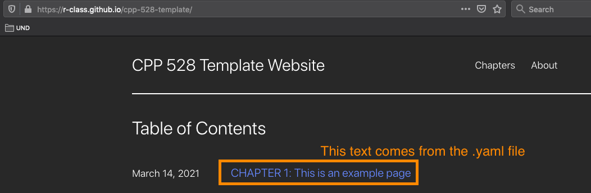
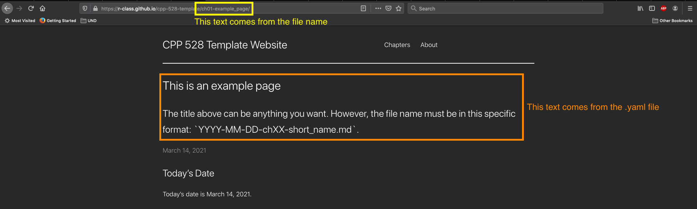

# Analysis

This directory stores the source code that is used to migrate your labs as chapters that go onto to be displayed on the website. Each `.rmd` file that lives within this `analysis/` directory serves as a direct input into the eventual `.md` files that go onto live within the `_posts/` directory: the folder that stores the chapters hosted on your website.

## Requirements

This is where you will store the `.rmd` files that make up your "Chapters" that will eventually live within the `_posts/` directory as `.md` files. Each `.rmd` file is a chapter and needs to be saved like this `YYYY-MM-DD-chXX-short_name.rmd`, where:

* `YYYY` is a four digit year (i.e. 2021)
* `MM` is a two digit month (i.e. 03 for March)
* `DD` is a two digit day (i.e. 14 for the 14th day)
* `chXX` references the chapter number (i.e. ch01 is the first chapter)
* `short_name` is a placeholder and needs to replaced with something meaningful (i.e. descriptive_statistics)

The title that is displayed back to the user is what you store within the `title: ` section in your YAML header within the `.md` file.





### YAML header must include a `gfm` variant of markdown output

Each `.rmd` file within `analysis/` must have a YAML header that contains an explicit reference to the [GitHub flavored markdown (gfm)](https://github.github.com/gfm/#what-is-github-flavored-markdown-) variant of markdown as the output that the `.rmd` knits out. Said differently, rather than only knitting out an HTML, you need to have your `.rmd` file also knit out an `.md` file.

Upon closer inspection of the YAML header within [`2021-03-014-ch01-example_page.rmd`](2021-03-014-ch01-example_page.rmd) reveals that the file contains two outputs: an HTML document (courtesy of [`rmdformats::downcute()`](https://github.com/juba/rmdformats#rmdformats)) and [`md_document`](https://bookdown.org/yihui/rmarkdown/markdown-document.html).

```yaml
---
title: "This is an example page"
subtitle: "The title above can be anything you want. However, the file name must be in this specific format: `YYYY-MM-DD-chXX-short_name.md`."
author: "Cristian E. Nuno"
date: "`r format(Sys.time(), '%B %d, %Y')`"
output:
  rmdformats::downcute:
    self_contained: true
    thumbnails: true
    lightbox: true
    gallery: false
    highlight: tango
    df_print: paged
  md_document:
    variant: gfm
---
```

As you move your polished labs into the `analysis/` folder, please make sure that their respective YAML headers include an `md_document` output that uses the `gfm` variant. This is a requirement that enables you to use the [`01_create_md_files.R`](01_create_md_files.R) that generated the `.md` files that eventually are used to display your work onto the website.

### Motivation
This separation is provided so that authors can safely re-run their analyses within that directory without worrying about accidentally updating their `.md` files under `_posts/` by mistake. 

### Debugging

For the authors, `.rmd` files can still be knit to `HTML` files; however, these files will not displayed back to the user (i.e. people reading your website). Instead, these `HTML` files are to be used by the authors when debugging or inspecting their results prior to creating the final `.md` files.


### How to migrate your `.rmd` files to `.md` files

The [`01_create_md_files.R`](01_create_md_files.R) file is the file that translates the `.rmd` files within `analysis/` into the `.md` files that live within `_posts/`. The authors are expected to update one particular portion of that file:

```r
# load necessary constants ----
FILE_INFO <- list(
  # note: all .rmd files must live in the analysis/ directory
  "rmd_files" = c(
    # each relative path to your .rmd file lives within one here::here() call
    here::here("analysis/2021-03-14-ch01-example_page.rmd")
  ),
  "yaml_files" = c(
    # each relative path to your .ymal file lives within one here::here() call
    here::here("assets/yaml/2021-03-14-ch01-example_page.yaml")
  )
)
```

Above, the `FILE_INFO` object is a list that stores two character vectors:

* `"rmd_files"`: each element is the file path to each `.rmd` file within the `analysis/` directory; and
* `"yaml_files"`: each element is the file path to each `.yaml` file within the `assets/yaml/` directory.

#### Remember `here::here()` only takes one relative path

As you add more relative paths to both your `FILE_INFO` object, the length of `FILE_INFO$rmd_files` and `FILE_INFO$yaml_files` will grow to reflect the additions. Currently, the length of both of these character vectors is one.

However, if you add two more chapters, the length of each of those vectors will be three. By comma separating each `here::here()` statement for each chapter you want added onto your website, you can safely use the code as is to see your work live on the website.

As a word of caution, please do no supply more than one relative path within a `here::here()` call. Instead, supply one relative path per `here::here()` call, where each call is separated by a comma.

#### Order matters so align your `.rmd` and `.yaml` files

**Order matters here**. That means the first `.rmd` file must match with its corresponding `.yaml` file. 

If something is out of place, you'll end up with mislabeled chapters.

### Guide to creating `.md` files

#### Run one `.R` script from the command line/command prompt
Once the analysis is ready to be shared on the website, the author must run the [`01_create_md_files.R`](01_create_md_files.R) script using the following code within the [command line/command prompt](https://support.rstudio.com/hc/en-us/articles/115010737148-Using-the-RStudio-Terminal#intro):

```bash
# this assumes you are currently within your root project directory
Rscript analysis/01_create_md_files.R
```

#### Using RStudio

Within RStudio, one can also open the [`01_create_md_files.R`](01_create_md_files.R) file, select all, and execute the code. For a guide, [see here](https://support.rstudio.com/hc/en-us/articles/200484448-Editing-and-Executing-Code).

Or, within the [RStudio console](https://support.rstudio.com/hc/en-us/articles/200404846-Working-in-the-Console), you can run the following R code as long as you within your [RStudio Project](https://ds4ps.org/cpp-528-spr-2021/sched/week-02/):

```r
# call the R file that sends your analysis/ .rmd files to the _posts/ directory as .md files
source(here::here("analysis/01_create_md_files.R"))
```

### Output

The `.rmd` files will be converted to `.md` files within the `_posts/` directory, along with their supporting sub-directories that contain support files such as plot `.png` files.

#### PNG files

As you add more graphics into your markdown files, you should be aware that hard copies of the `.png` files are being stored not within `analysis/` but within `assets/img/YYYY-MM-DD-chXX-short_name_files/`. When you inspect the `.md` files, you will see that they all are referencing these `.png` files via relative paths.

#### `.yaml` files

The `title` and `subtitle` of each `.md` file lives within `assets/yaml/YYYY-MM-DD-chXX-short_name.yaml`. You will need modify and create corresponding `.yaml` files to ensure that your chapters are labeled correctly.

[Click here to see the `.yaml` file](../assets/yaml/2021-03-14-ch01-example_page.yaml) that was used within the sample `.rmd` file.
